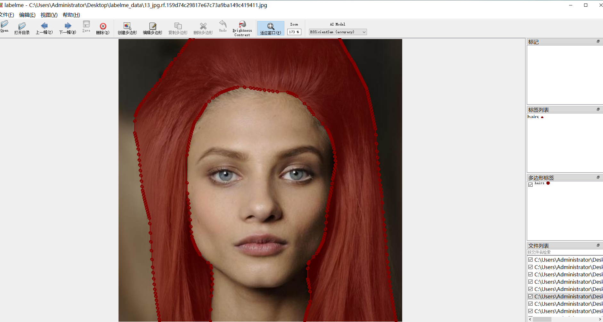
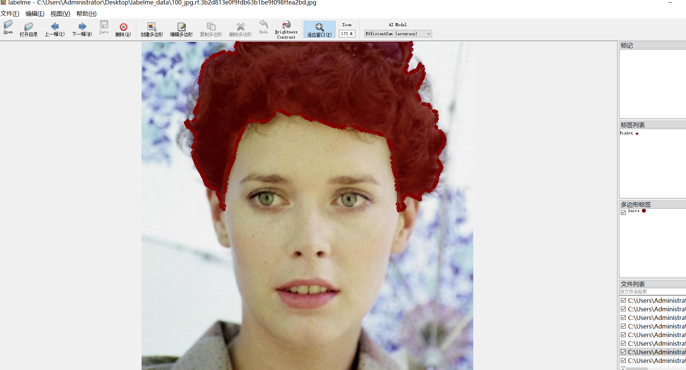
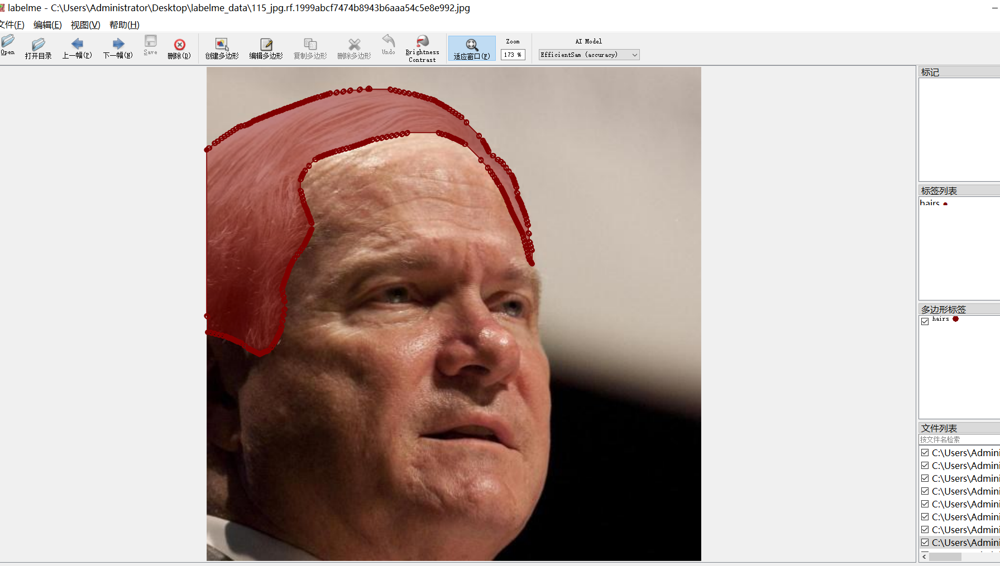
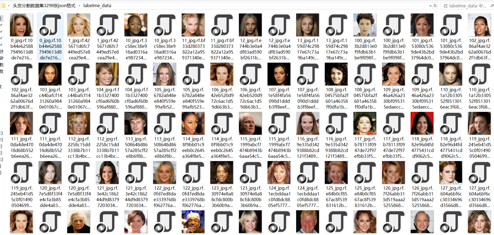

# Hair Segmentation Dataset 3298 imagesjsonformat

Hair Segmentation Dataset (3298 images, JSON format)

The dataset format is LabelMe format (without mask files, only containing jpg images and corresponding json files).

Number of images (number of jpg files): 3298

Number of JSON files: 3298

Number of categories: 1

["hairs"]

Number of boxes labeled in each category:

hairs count = 3923

Total frame count: 3923

Using the labelling tool: Labelme=5.5.0

Image Resolution: 512x512

Rules for Markup: Draw a polygon around the category.

Important Note: You can open and edit the dataset using LabelMe. For JSON datasets, you need to convert them into Mask or Yolo format for semantic segmentation or instance segmentation.

Special Disclaimer: This dataset does not guarantee the accuracy of the trained models or weight files.

Annotation and image details are as follows:

## Images

---

Here is a pay link on Stripe (https://buy.stripe.com/3cs8yP7sY87d0vu9AB). Please contact me lonlonago@foxmail.com after funding $89, and I will send you a complete data files, thank you!

